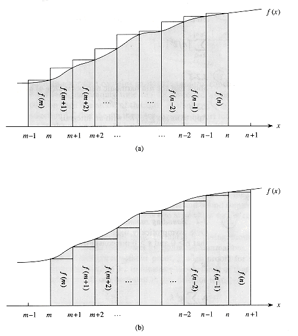

# 求和

来源 --《算法导论》附录 A   
在分析算法的运行时间时，特别地，算法中包含 while 或 for 循环时，需要进行累加计算，形如：

$$\sum_{k=1}^{n}f(k)$$

## 求和

### 等差级数
数列求和是高中数学内容之一，先从最简单的等差数列开始复习：

$$\sum_{k=1}^{n}k = 1 + 2 + ... + n$$

其值为

$$\sum_{k=1}^{n}k = \frac{1}{2}n(n+1)$$

大家应该还记得小高斯快速计算 1 + 2 + 3 + ... + 100 的故事，上面公式不难理解和推导。  
或许多多少少对这几个概念还有印象：   
公差：d   
首项：$a_1$   
第 n 项：$a_n$   
前 n 项和： $S_n=\frac{n(a_1 + a_n)}{2}=na_1 + \frac{n(n-1)}{2}d$   
通项公式： $a_n = a_1 + (n - 1)d$

不过这儿我们只关注数列和，即级数

### 平方和与立方和
平方和与立方和求和公式如下：

$$\sum_{k = 1}^{n}{k}^2 = \frac{n(n + 1)(2n + 1)}{6}$$
$$\sum_{k = 1}^{n}{k}^3 = \frac{{n}^2{(n + 1)}^2}{4}$$

上面的两个公式用数学归纳法不难证明。我们也可以自己推导，以平方和为例：   
可以利用恒等式 $(k+1)^3 - k^3 = 3k^2 + 3k + 1$ 来计算平方和的值，因为我们注意到对左侧进行累加求和可以消项，即

$$\sum_{k = 1}^{n}{(k+1)}^3 - k^3 = (n+1)^3 - 1$$

对右侧累加求和，有

$$\begin{aligned}
(n+1)^3 - 1 &= 3\sum_{k = 1}^{n}k^2 + 3\sum_{k = 1}^{n}k + n \\\\
(n+1)^3 - 1 &= 3\sum_{k = 1}^{n}k^2 + \frac{3n(n + 1)}{2} + n \\\\
\end{aligned}$$
也就是
$$\begin{aligned}
3\sum_{k = 1}^{n}k^2 &= (n+1)^3 - 1 - \frac{3n(n + 1)}{2} - n \\\\
                    &= (n+1)(n^2+2n) - \frac{3n(n + 1)}{2} \\\\
                    &= (n+1)(2n^2+4n-3n) \\\\
                    &= n(n+1)(2n + 1)/2
\end{aligned}$$

同样的方法，我们可以推导出立方和公式，这儿留给你自己推导。  
我们再回过头来看下奇数列：

$$\sum_{k = 1}^{n}2k - 1 = 1 + 3 + 5 + ... + n$$

可以用等式 $(n)^2-(n - 1)^2 = 2n-1$ 很容易推导出其前 n 项和 $S_n$ 为 $n^2$

### 几何级数
对于 $x\neq 1$ 的实数，和式
$$\sum_{k = 1}^{n}x^k = 1 + x + x^2 + ... + x^n$$

两步同乘以 x 有
$$xS_n = \sum_{k = 1}^{n + 1}x^k = S_n - 1 + x^(n + 1)$$
就得到
$$S_n = \sum_{k = 1}^{n + 1}x^k = \frac{x^(n + 1)-1}{x - 1}$$

当和是无限的并且|x|<1时，有无限递减几何级数
$$\sum_{k = 1}^{\infty}x^k = \frac{1}{1 - x}$$

温习完等等差级数和几何级数，做两道题练习一下

A.1-4 证明 $\sum_{k = 0}^{\infty}(k - 1)/2^k = 0$

A.1-8 计算 $\prod_{k = 2}^n(1 - 1/k^2) 提示：无需转化为求和

### 调和级数
调和级数是一个发散的无穷级数，第 n 个调和数是

$$H_n=\sum_{k = 1}^{n}1/k = 1 + 1/2 + 1/3 + ... + 1/n = lnn + O(1)$$

## 确定求和时间的界
在分析算法运行时间时，通常我们并不需要给出一个准确值，只需要描述出级数的界。比如，平方和级数 $\sum_{k = 1}^{n}{k}^2$ 的界是 $O(n^3)$，在给出一个猜测之后，用数学归纳法不难证明。求取复杂级数的界的技巧这儿就不再介绍，这儿简单介绍下积分求和确定上下界的方法。

### 积分求和确定上下界

假定级数为 $\sum_{k = m}^{n}f(k)$，其中 $f(k)$ 是单调递增函数，则有

$$\int_{m - 1}^{n}f(x)dx \leqslant \sum_{k = m}^{n}f(k) \leqslant \int_{m}^{n + 1}f(x)dx$$

如下图所示，矩形总面积代表级数的值，曲线下方面积代表积分近似值，不难理解上述不等式。   



如果 $f(k)$ 是单调递减函数，则有

$$\int_{m}^{n + 1}f(x)dx \leqslant \sum_{k = m}^{n}f(k) \leqslant \int_{m - 1}^{n}f(x)dx$$


对于调和级数，我们由

$$\int_{1}^{n+1}1/xdx \leqslant \sum_{k = m}^{n}1/k \leqslant \int_{0}^{n}1/xdx$$
$$ln{(n+1)} \leqslant \sum_{k = m}^{n}1/k \leqslant \ln{n} + 1dx$$


## 应用

### 建堆复杂度分析

```cpp
BUILD-MAX-HEAP(A)
  A.heap.size = A.length
  for i = [A.length/2] downto 1
    MAX-HEAPIFY(A, i)      
```

已知每次调用 MAX-HEAPIFY 的时间复杂度是 O(lgn)，所以初步给出建堆的时间复杂度为 O(nlgn)，不过这个上界不是渐近紧确的。
可以观察到，叶子节点调用 MAX-HEAPIFY 次数最多，一直到根节点调用次数呈指数级收敛，而 MAX-HEAPIFY 运行时间只与高度有关。在一个高度为 h 的节点上运行 MAX-HEAPIFY 的代价是 O(h), 我们可以将 BUILD-MAX-HEAP 的总代价表示为

 $$\sum_{h = 0}^{\left \lfloor lg{n} \right \rfloor } \left \lceil \frac{n}{2^h+1} \right \rceil O(h)
 =O\left ( n \sum_{k = 0}^{\left \lfloor lg{n} \right \rfloor } \frac{h}{2^h} \right)$$

根据我们刚刚温习的知识，我们可以推导出 $$\sum_{k = 0}^{\infty} \frac{h}{2^h} = 2$$
现在，我们就可以将建堆的时间复杂度修正为 O(n)

### 雇用两次的概率 （出自 `5.2-2`）
首先介绍下 `HIRE-ASSISTANT` 程序：面试 n 个候选人，如果当前候选人是目前最优秀的，就雇用它。
现在假设应聘者以随机顺序出现，正好雇用两次的概率是多少？

为简单分析起见，我们假定n 个不同的数从 1 到 n，按数目大小比较是否优秀。以随机顺序出现，所有的排列有 n! 种情况。
先来说说正好雇用一次的概率，也就是 n 个数中第一个就是最大的，概率是 1 / n 。刚好雇用 n 次的概率，也就是刚好按递增顺序排列，概率是 1 / n!
考虑到第一个和最优秀的总会被雇用，最优秀候选人在每个位置的概率相等均为 1 / n，假定最优秀的候选人所在位置为 k，那第一个应该是前 (k - 1) 个候选人中最优秀的，概率为 1/(k - 1)。

所以我们要求的概率为
$$\sum_{k = 1}^{n - 1} \frac{1}{nk}$$


