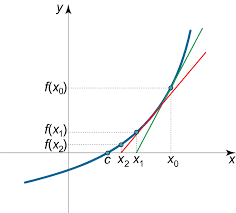

# 开方计算

日常工作中，可能时不时就会调用标准库中的 $\sqrt{x}$ 方法。尽管对这个函数大家并不陌生，但它是如何计算的，可就没几个人说的清了。
这部分内容属于《数值计算方法》，不过我发现很多 CS 专业的同事都不晓得这门课程。下面就以 $\sqrt{2}$ 为例简单介绍几种方法。

## 一点思路

要计算 $\sqrt{2}$, 其实是对方程 $x^2 - 2 = 0$ 进行求根。我们先来考察一下函数 $f(x) = x^2 - 2$，它在区间 $[0, \infty]$ 之间是单调连续的，并且有 $f(1)*f(2)<0$。所以，在 $[1, 2]$ 之间必有一点满足 $f(x^{\ast}) = 0$，也就是说方程有实根。
> 这个有点太简单，不过对于任意的函数也是同样的道理。这儿介绍的方法同样适用于其它的函数。

## 逐步扫描法
有了上面的铺垫，我们可以想到一个暴力解法，找到一个近似的解。假定我们只需要精确到 2 位，我们可以选择起点为 1，步长为 0.01，起始时 $f(1) < 0$ 当我们发现一个值 $f(x^{\ast}) > 0$ 我们就找到了一个近似解。

## 二分法
上面的暴力解法毕竟有点耗时，我们可以考虑用二分法，每次都可以将区间范围缩小一半。这儿有一点实现上的不同，何时终止的问题。我们可以设定我们的误差值为 $\varepsilon$ 只要 $|x^{\ast2} - 2| < \varepsilon$ 我们就终止循环。

练习：求方程 $f(x) = x^3 - x - 1 = 0$ 在区间 $[1, 1.5]$内的一个实根，要求准确到小数点后的第二位。

## 牛顿法
牛顿法或者又叫牛顿迭代法，这是我们要介绍的重点。这要从泰勒展开式说起   
$$f(x) = f(x_0) + \frac{f'(x_0)}{1!}(x - x_0) + \frac{f^{2}(x_0)}{2!}(x - x_0)^2 + ... + \frac{f^{(n)}(x_0)}{n!}(x - x_0)^n + R_n(x)$$
好复杂是不是？不过没关系，我们只用到前两项。对于  $f(x) = x^2 -2$ 来说，只有两项，不过即便是其它有无穷多项的函数，我们也只取两项。现在我们可以得到一个近似的线性方程。

$$f(x_0) + f'(x_0)(x - x_0) = 0$$

设 $f'(x_0) \neq 0$ 因为 $x_0$ 是我们自己随意选的。有
$$x = x_0 - \frac{f(x_0)}{f'(x_0)}$$

这样我们就得到了一个迭代关系式

$$x_{n+1} = x_n - \frac{f(x_n)}{f'(x_n)}$$

对于我们要求的函数 $f(x) = x^2 -2$ 来说，迭代关系式为

$$x_{n+1} = \frac{1}{2}x_n + \frac{1}{x_n}$$

取 $x_0 = 1$，计算结果如下所示

|k|$x_k$|
|--- | --- |
|1|1.5|
|2|1.4166666666666665|
|3|1.4142156862745097|
|4|1.4142135623746899|
|5|1.414213562373095|
|6|1.414213562373095|

牛顿法有很好的收敛性，从上面可以看出每次迭代有效数字位翻倍。我们使用迭代法的时候总会关注是否收敛，或者牛顿法收敛有哪些条件。充分条件是 $f'(x^{\ast}) \neq 0$，以及 $x_0$ 位于 $x^{\ast}$ 的临近区域内。

怎么理解牛顿法？看下图 c 是我们要求的 $x^{\ast}$， 起始点为 $x_0$， 切线斜率为在切点处的导数。

练习：用牛顿法求解 Leonardo 方程 $f(x) = x^3 + 2x^2 + 10x - 20$

## 总结

上面介绍的方法只是以求平方根为例，对于任意的函数只要满足条件，我们都可以使用上面说讲的方法。这部分内容只是《数值计算方法》中求解非线性方程部分，有兴趣同学可以借阅这本书看看。

> 关于数值计算方法的资料很少，可以找到有天津理工大学的一份[课程资料](https://github.com/DukeWF/TJUT_CS_Helper/tree/master/%5B%E5%BF%85%E4%BF%AE%5D%E6%95%B0%E5%80%BC%E8%AE%A1%E7%AE%97%E6%96%B9%E6%B3%95/%E6%95%B0%E5%80%BC%E8%AE%A1%E7%AE%97%E5%A4%8D%E4%B9%A0pdf)    
> 关于牛顿法：如何通俗易懂地讲解牛顿迭代法求开方？数值分析？ - 马同学的回答 - 知乎
https://www.zhihu.com/question/20690553/answer/146104283
